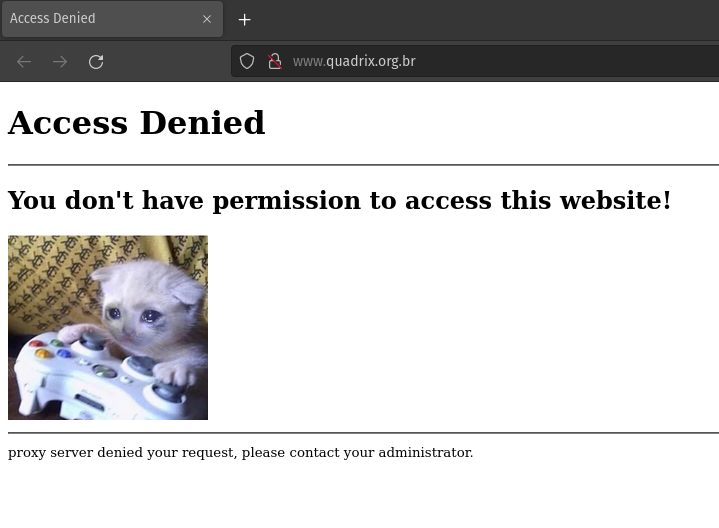
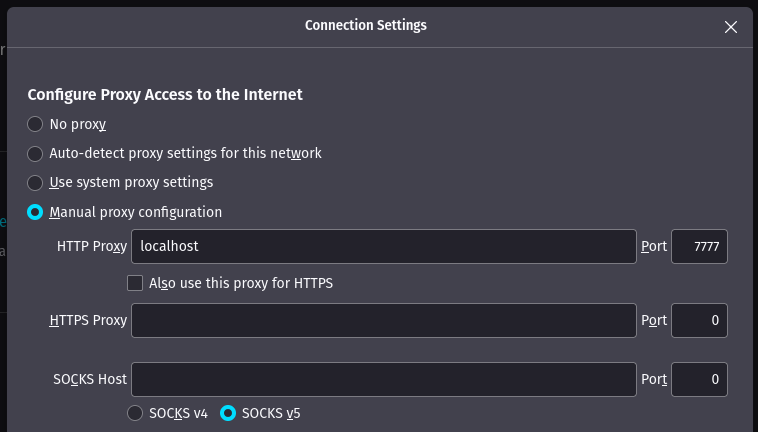

# Redes de Computadores I - Sockets

## Ideia: Proxy Server

## What is a Proxy?

A proxy server is a system or router that provides a gateway between users and the internet. Therefore, it helps prevent cyber attackers from entering a private network. It is a server, referred to as an “intermediary” because it goes between end-users and the web pages they visit online.

When a computer connects to the internet, it uses an IP address. This is similar to your home’s street address, telling incoming data where to go and marking outgoing data with a return address for other devices to authenticate. A proxy server is essentially a computer on the internet that has an IP address of its own.

## What is implemented?

The proxy server implemented provides a deny list where the network administrador can set a collection of forbidden urls. You can set:

```python
"DENY_LIST": ["www.quadrix.org.br", "httpforever.com", "captive.apple.com"]
```

Then, when the user tries to access this site, they will receive:



Sites that are not in the list will be loaded as usual.

## How was it implemented?

Using sockets, the server creates a TCP connection which receives **HTTP** requests from a web browser (https request will not work due to the certificate validation). For each new connection, a thread will be created to handle that request. If the requested url is not in the deny list, a new socket connection will be created to the the requested url, then the received data will be streamed to the client, otherwise the `denied.html` page will be returned.

## Creating a proxy server

To create a proxy, you have to set the configuration dictionary and create a Server object:

```python
from src.server import Server


def main():
    config = {
        "CONNECTION_TIMEOUT": 50,
        "HOST": 'localhost',
        "PORT": 7777,
        "BUFFER_SIZE": 1024,
        "DENY_LIST": ["httpforever.com", "captive.apple.com"]
    }

    Server(config=config)


if __name__ == "__main__":
    main()

```

To run it, just run the python script:

```
$ python server/main.py
```

To use it on your browser, you can set the proxy properties manually (firefox as example):



To use it on your local access network, use the ip of the computer running the proxy instead of localhost on the browser/system proxy settings.

## HTTP Websites for Testing

- http://httpforever.com/
- http://captive.apple.com/
- http://shiningquietsilvermelody.neverssl.com/online
- http://www.quadrix.org.br/
